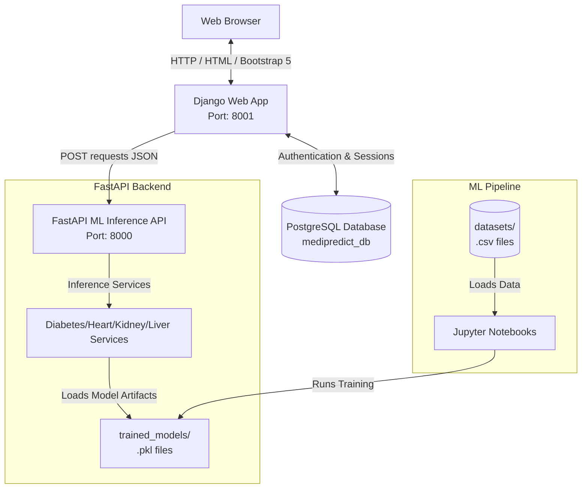

# MediPredictAI 🏥

MediPredictAI is an end-to-end medical diagnostic prediction platform. It leverages machine learning models to predict the probability of four major diseases (Diabetes, Heart Disease, Kidney Disease, and Liver Disease) based on clinical patient features.

The project is structured as a decoupled system featuring a user-facing **Django web application**, a high-performance **FastAPI inference API** wrapper for the machine learning models, and an **ML training pipeline** containing datasets, notebooks, and scripts.

---

## 🏛️ System Architecture

MediPredictAI utilizes a decoupled architecture where the frontend web portal and the machine learning model services run on separate, independent processes.



### Flow of Execution:
1. **User Authentication & Forms**: The user registers/logs in to the **Django Web Portal** (running on port `8001`). They are presented with a clinical questionnaire form for one of the target diseases.
2. **Form Submission & API Request**: When the form is submitted, Django validates the form and makes a synchronous POST request with the JSON payload to the **FastAPI Inference Service** (running on port `8000`).
3. **Data Preprocessing & Inference**: FastAPI validates the incoming payload using Pydantic schemas, converts it into a DataFrame, runs pandas one-hot encoding, aligns columns to match the trained features, standardizes it via a StandardScaler, and queries the trained Scikit-Learn classification model.
4. **Result Rendering**: FastAPI returns the prediction result (Positive/Negative) and probability confidence score. Django receives the JSON response, interprets the risk levels, and renders the result and professional recommendations back to the client browser.

---

## 📁 Project Directory Structure

```text
MediPredictAI/
│
├── django_app/                    # Web frontend & user dashboard (Django)
│   ├── config/                    # Global settings, URLs, ASGI/WSGI
│   ├── accounts/                  # User registration, login, logout
│   ├── core/                      # Main landing page
│   ├── dashboard/                 # User dashboard views & stats
│   ├── patients/                  # Patient management views (extension placeholder)
│   ├── predictions/               # Web forms & result templates for predictions
│   ├── static/                    # Static assets (CSS, JS, images)
│   ├── templates/                 # HTML views (extends Bootstrap 5)
│   └── manage.py                  # Django CLI management script
│
├── fastapi_app/                   # Machine learning prediction API (FastAPI)
│   └── app/
│       ├── main.py                # App initialization & routers inclusion
│       ├── routes/                # Endpoint routers (diabetes, heart, kidney, liver)
│       ├── schemas/               # Pydantic request models
│       ├── services/              # Inference wrappers loading pickle files
│       └── utils/                 # Utilities
│
├── ml_training/                   # Machine learning training pipelines & artifacts
│   ├── datasets/                  # Source CSV files (diabetes, heart, kidney, liver)
│   ├── notebooks/                 # Jupyter Notebooks for training models
│   ├── scripts/                   # Model validation/testing scripts
│   └── trained_models/            # Trained model artifacts (.pkl files)
│
├── requirements.txt               # Project dependency package list
└── README.md                      # Project documentation
```

---

## ⚙️ Installation & Setup

### Prerequisites
* Python 3.10+
* Git
* PostgreSQL (Running locally)

### 1. Clone the Repository
```bash
git clone <your-repository-url>
cd MediPredictAI
```

### 2. Setup Virtual Environment & Install Dependencies
Create a virtual environment and install the package requirements:
```bash
# Create environment
python -m venv venv

# Activate on Windows
venv\Scripts\activate

# Install dependencies
pip install -r requirements.txt
```

### 3. Database Configuration
Make sure PostgreSQL is running locally. By default, Django is configured in `django_app/config/settings.py` to connect to:
* **Database Name**: `medipredict_db`
* **Username**: `postgres`
* **Password**: `admin@123`
* **Host**: `localhost`
* **Port**: `5432`

Run database migrations to prepare the user session tables:
```bash
cd django_app
python manage.py migrate
cd ..
```

---

## 🚀 Running the Platform

To run the full platform, you need to spin up the **FastAPI Backend** and the **Django Frontend** concurrently.

### Step 1: Start the FastAPI API (Port 8000)
In your first terminal:
```bash
cd fastapi_app
python -m uvicorn app.main:app --reload
```
You can inspect the interactive OpenAPI documentation at `http://127.0.0.1:8000/docs`.

### Step 2: Start the Django Portal (Port 8001)
In your second terminal:
```bash
cd django_app
python manage.py runserver 8001
```
Open `http://127.0.0.1:8001` in your browser to access the user portal.

---

## 🧠 Machine Learning Pipelines

Each of the diagnostic tools uses custom-trained classifiers located under `ml_training/trained_models/`. 

### Training the Models
The models can be trained or refined using the Jupyter Notebooks located in `ml_training/notebooks/`. 
Each notebook trains several models (Logistic Regression, Decision Trees, Random Forests, KNNs, SVMs), selects the model with the highest F1-Score/Accuracy, standardizes features, and exports the serialized model, scaler, and feature columns using `joblib`.

To run the training scripts directly:
```bash
cd ml_training/scripts
python heart_prediction_train.py
python kidney_prediction_train.py
python liver_prediction_train.py
```

### Models Utilized:
* **Diabetes**: Trained on 100,000 patient records using Random Forest classifier.
* **Heart Disease**: Trained on 918 patient records using Random Forest classifier.
* **Kidney Disease**: Trained on 400 patient records (incorporating missing values imputation and data type corrections) using Random Forest classifier.
* **Liver Disease**: Trained on 583 patient records using Random Forest classifier.
